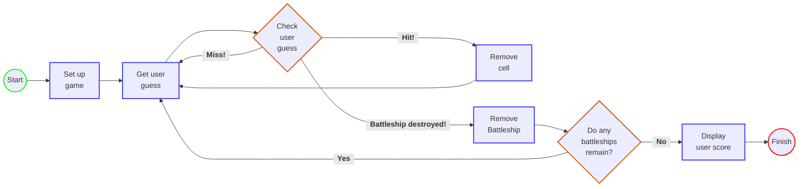

# Battleship - The Classic Strategy Guessing Game

### **Goal:**
Sink all the computer's battleships in the fewest number of guesses.  
At the end, the player receives a rating based on performance.  
 

### **Setup:**
When the program is launched, the computer places three battleships on a virtual
7x7 grid. Each battleship takes up three cells.  
When that's complete, the game asks the player for the first guess.  
 

### **How to play:**
The computer will prompt the player for a guess that will be entered into
the console as "A3", "a5", etc.  
In response to the guess, the player will see a result in the console
indicating "Hit", "Miss", or "Battleship destroyed!".

When the player destroys every computer battleship, the game ends and displays the user's score.
 
 

## Visualization

An example game would have the following layout on the virtual grid:

Ship locations are randomly generated using the _placeBattleship()_ method found in the GameHelper class.

 

## Design Diagram

 

## Example Game

The application begins with a title screen and game instructions for the user:

 

Guesses are progressively entered until the player destroys the total number of ships
(default of 3) and wins the game:

 

If a player enters a guess located outside the grid, or containing illegal characters, 
the following warning will display:

 

## Future Ideas for Improvement

### **Addition of a GUI**  
While the game functions as expected, it can be a little difficult for a user to keep track of all of their guesses.  
It would be great to include a graphic interface allowing players to pick their guessing locations and have previous 
guesses tracked visually.  
 

### **Prevent guessing the same location twice**
Currently, a player can accidentally (or mistakenly) enter the same location multiple times when guessing.  
Adding a preventative measure that avoids counting these previous guesses would improve the player experience. 

