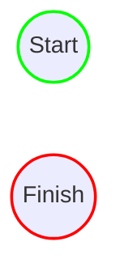

# Email Administration Application

This is an instructional project that uses the following scenario:  
 

You are an IT Support Administrator Specialist and are charged with the task of creating
email accounts for new hires.  
Your application should do the following:

1.) Generate an email with the following syntax:  firstname.lastname@department.company.com.  
2.) Determine the department (sales, development, accounting). If none, leave blank.  
3.) Generate a random string for a password.  
4.) Have set methods to change the password, set the mailbox capacity, and define an alternate email address.  
5.) Have GET methods to display the name, email, and mailbox capacity.

 

## Design Diagram

