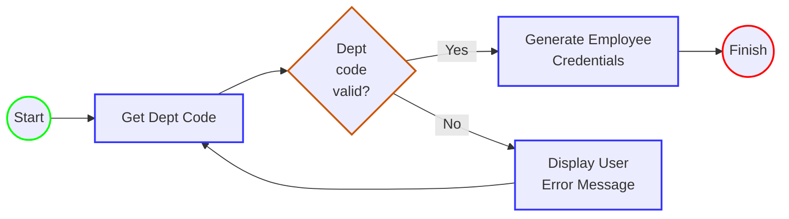

# Email Administration Application

This is an instructional project that uses the following scenario:  
 

You are an IT Support Administrator Specialist and are charged with the task of creating
email accounts for new hires.  
Your application should do the following:

1.) Generate an email with the following syntax:  firstname.lastname@department.company.com.  
2.) Determine the department (sales, development, accounting). If none, leave blank.  
3.) Generate a random string for a password.  
4.) Have set methods to change the password, set the mailbox capacity, and define an alternate email address.  
5.) Have GET methods to display the name, email, and mailbox capacity.

 

## Design Diagram

 

## **Example Use**

The application begins by delivering a prompt to the user asking for the employee's department
code from the provided list.  
Upon entering a proper code, a credentials block for the employee is displayed.

 

In the event that the user enters an invalid code, the following error is displayed, and returns the user  
back to the department code input message:

 

## Future Ideas for Improvement

### **Prompt to enter employee name**
Rather than directly entering an employee's name into the main method, entering the name using the console  
would be a better option (and less prone to causing issues for users unfamiliar with the code).

 

### **Create database to hold employee credentials**
The application can successfully generate an employee's credentials, but there's nothing saving it anywhere.  
Without being able to reference those credentials from a saved location 
there's no way to verify them later.

 

### **Prevent user from entering blank department code**
Currently, a user can press the enter key when prompted to enter the department code an unlimited number of times 
in the scanner input.  
This leads to a large number of empty lines in the scanner, which doesn't detect anything until a character is submitted.  
A preventative measure should be added that doesn't allow such an input to occur.