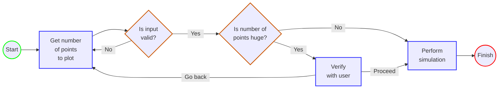

# Monte Carlo Pi Simulation

This is a program that estimates the value of π by using randomly plotted points.  
(Technically, these plots are not truly random but _pseudorandom_. An important distinction.)

(To be continued)

## Design Diagram

 

## Future Ideas for Improvement

### **Ask player how many points they want plotted**
At the moment, the number of plotted points is hardwired into the code. This should be adjustable to the user to allow
arbitrary levels of accuracy in the estimation.

 

### **Add text to JFrame indicating approximation value**
Rather than displaying the estimation result in the console, it would be cool to see the estimation change in real-time.  
This could be achieved by adding a text line in the JFrame window that updates every time repaint occurs.
(Maybe at the bottom?)

 

### **Add secondary JFrame showing xy plot**
Another great visual would be a secondary JFrame that plots the estimation value as the number of points increases.  
This would give the user a sense of how the number of points directly influences the estimation outcome. 

 

### **Some visual effect for points inside vs. outside the arc**
Users should be clearly aware whether points are counting towards the estimation, or if they land outside the acceptable
range.  
Currently, that's not entirely obvious. Consider "good" points as one color, and "bad" points as another.
(Red vs. green?)

 

### **User control of plotting speed**
As a user, it would be nice to be able to control how fast the points are plotted.  
May want to consider incorporating several plotting speeds (i.e. slow, medium, fast, instant).