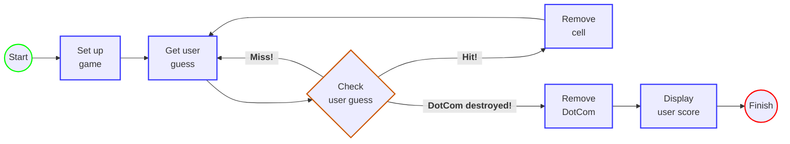

# Sink a Dot-Com (A Battleship-Like Game)

This is a simple game where the player faces off against the computer. 

### **Goal:**  
Sink all the computer's Dot Com "ship" in the fewest number of guesses.  
At the end, the player receives a rating based on performance.  
  

### **Setup:**  
When the program is launched, the computer places three Dot Coms on a virtual 
1x7 grid. Each Dot Com takes up three cells.  
When that's complete, the game asks the player for the first guess.  
 

### **How to play:**  
The computer will prompt the player for a guess (a cell) that will be entered into
the terminal as "A3", "A5", etc.  
In response to the guess, the player will see a result in the terminal
indicating "Hit", "Miss", or "You sunk (something).com".

When the player has sent the Dot Com to the big 404 in the sky, the game ends by displaying the user's rating.
 
 

## Visualization

A visual of the game's layout looks something like this:  

</img>

Where successful hits would be found at A4, A5, and A6.
 
 

## Design Diagram

